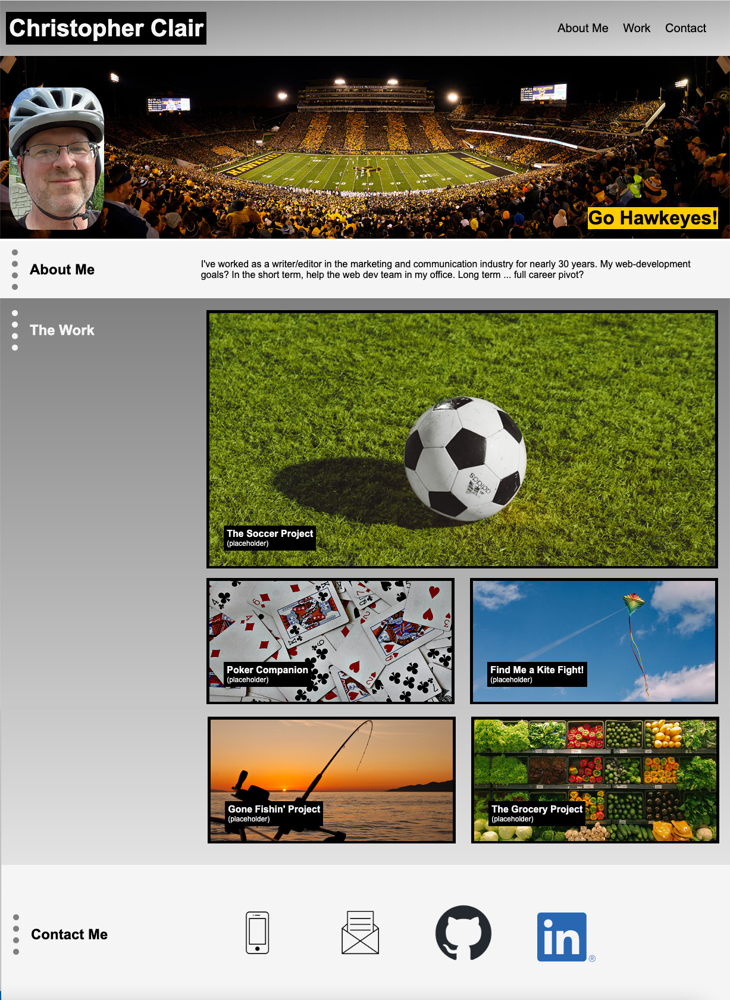

# Week 02: Portfolio Build
A project that will allow me to apply core skills (flexbox, media queries, and CSS variables) and eventually allow me to showcase my work.
## User Story
```
AS AN employer
I WANT to view a potential employee's deployed portfolio of work samples
SO THAT I can review samples of their work and assess whether they're a good candidate for an open position
```
## Acceptance Criteria
```
GIVEN I need to sample a potential employee's previous work
WHEN I load their portfolio
THEN I am presented with the developer's name, a recent photo or avatar, and links to sections about them, their work, and how to contact them
WHEN I click one of the links in the navigation
THEN the UI scrolls to the corresponding section
WHEN I click on the link to the section about their work
THEN the UI scrolls to a section with titled images of the developer's applications
WHEN I am presented with the developer's first application
THEN that application's image should be larger in size than the others
WHEN I click on the images of the applications
THEN I am taken to that deployed application
WHEN I resize the page or view the site on various screens and devices
THEN I am presented with a responsive layout that adapts to my viewport
```

## Description/Summary

This site will serve as a portfolio of my work, something that I can show to potential employers down the road. For now, the portfolio consists of placeholder material. Some of the placeholder material I intend to flesh out into real projects as practice material. Others, well, I thought the pictures were nice. (Although perhaps I will find a market for a Kite Fight Finder?)

The header contains my name and links to the three sections of the site: About Me; The Work; Contact Me. Hovering over the banner links causes the background and text colors to inverse. Under that, I have a banner section that includes an inset selfie (I like to ride bicycles), a shot of my beloved Hawkeyes at Kinnick Stadium, and an inset shoutout to said Hawkeyes.

The About Me summarizes my professional background and my future ambitions in web development.

The Work section features a fictional (but perhaps real in the not-too-distant future) project involving soccer (or football, depending on where you're at). I made this my primary entry. The rest of the section features four secondary projects. The Poker Companion is another one I intend to make real, an app that my poker group can use to quickly reference the rules and turn to for a random suggestion. Each card has a title card that overlays the image at screen sizes wider than 650px and cards that are placed directly below the image at 650px and smaller screen size. When the cursor hovers over a card, a dotted gold border (the gold value specific to the University of Iowa, for what it's worth) appears around the image.

The Contact Me section provides a "tel" link with my cell phone number, a "mailto" link with my email address, and links to my GitHub page and my LinkedIn page. Hovering over each icon causes a pop-up box with description. I will eventually curate my GitHub page to pin the projects of which I'm most proud.

The site responds to changes in screen size, with break points at 992px and 650px. 

I incorporated a few things we learned about in class (hover behavior, data-descr, relative/absolute positions). One particular hover behavior I found on CSS-tricks; I will cite the specific source below.

## Overview of Site



## Link to Deployed Site
https://cwclair.github.io/02-portfolio-build/

## Resources Used

The hover behavior on my header was something I discovered on CSS Tricks. Here is the link to the page with this code: https://css-tricks.com/css-link-hover-effect

